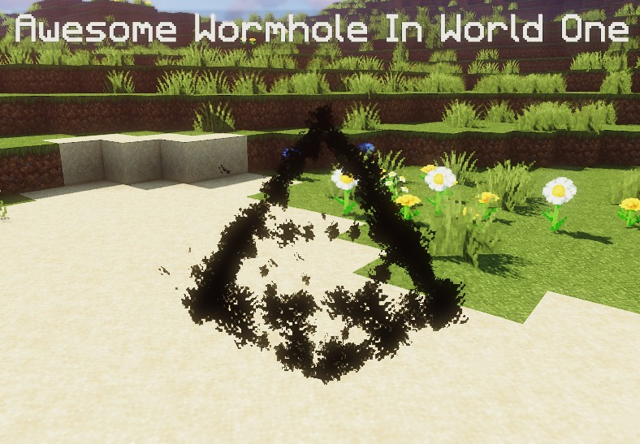

好的，我将把输入的文本翻译成简体中文，并保留 Markdown 格式。

[](https://magmaguy.com/webapp/webapp.html)

# 什么是虫洞？

虫洞是一种高效的点对点传送系统。传送门有视觉效果标记。

# 虫洞机制

虫洞可以实现以下功能：

*   通过一个传送门到达目的地传送门，并从目的地传送门返回第一个传送门。
*   玩家通过时播放声音
*   在通过时暂时致盲玩家以平滑过渡
*   将玩家推出以避免陷入传送循环
*   锁定玩家 5 秒使其无法传送，以避免陷入传送循环
*   播放精美的视觉效果
*   需要权限才能使用虫洞
*   需要花费货币才能使用虫洞
*   在目的地传送门不可用时通知玩家和管理员

# 创建虫洞

虫洞作为配置文件添加到 wormholes 文件夹中。可以创建子文件夹，建议为特定地牢创建子文件夹，格式为 \` ~/plugins/EliteMobs/wormholes/dungeonName/dungeonName\_identifier.yml\`。

### 弹出

`location1` 和 `location2` 中的 Yaw 和 Pitch（坐标中的最后两位数字）将设置玩家通过虫洞时被弹出的方向。看这个例子：

`location1: my_world,20,10,20,180,20`

Yaw 设置为 `180` 时，玩家将被弹出并面向北方，Pitch 设置为 `20` 时，他们也会稍微向上弹出。如果你希望玩家在被弹出时留在与虫洞相同的方块中，那么最好将 Pitch 设置为负数，以确保玩家不会从方块上滑落。

## 虫洞配置
以下是一个有效的虫洞配置示例：

```yaml
isEnabled: true
location1: em_primis,1288.5,19,452.5,135,-23
location2: em_primis,1288.5,-39,451.5,180,-1
```

***

<div align="center">

### isEnabled

设置虫洞是否启用。

| Key       |       Values        | Default |
|-----------|:-------------------:|:-------:|
| `isEnabled` | [Boolean](#boolean) | `true`  |

<details>

<summary><b>示例</b></summary>

<div align="left">

```yml
isEnabled: true
```

</div>

</details>

***

### location1

指定虫洞的第一个位置。

| Key       |      Values       | Default |
|-----------|:-----------------:|:-------:|
| `location1` | [String](#string) |  无   |

<details>

<summary><b>示例</b></summary>

<div align="left">

```yml
location1: world_one,50,100,50,0,0
```

</div>

</details>

***

### location2

指定虫洞的第二个位置。

| Key         |      Values       | Default |
|-------------|:-----------------:|:-------:|
| `location2` | [String](#string) |  无   |

<details>

<summary><b>示例</b></summary>

<div align="left">

```yml
location2: world_two,100,33,100,0,0
```

</div>

</details>

***

### location1Text

设置第一个位置的显示文本。

| Key         |      Values       | Default |
|-------------|:-----------------:|:-------:|
| `location1Text` | [String](#string) |  无   |

<details>

<summary><b>示例</b></summary>

<div align="left">

```yml
location1Text: Awesome Wormhole In World One
```

<div align="center">



</div>

</div>

</details>

***

### location2Text

设置第二个位置的显示文本。

| Key         |      Values       | Default |
|-------------|:-----------------:|:-------:|
| `location2Text` | [String](#string) |  无   |

<details>

<summary><b>示例</b></summary>

<div align="left">

```yml
location2Text: Awesome Wormhole In World Two
```

<div align="center">


</div>

</div>

</details>

***

### permission

设置使用虫洞所需的权限。

| Key         |      Values       | Default |
|-------------|:-----------------:|:-------:|
| `permission` | [String](#string) |  无   |

<details>

<summary><b>示例</b></summary>

<div align="left">

```yml
permission: elitemobs.mypermission
```

</div>

</details>

***

### coinCost

设置使用虫洞所需的精英币花费。

| Key         |      Values       | Default |
|-------------|:-----------------:|:-------:|
| `coinCost` | [Double](#double) |  无   |

<details>

<summary><b>示例</b></summary>

<div align="left">

```yml
coinCost: 2.5
```

</div>

</details>

***

### style

设置虫洞的视觉形状。

*构成这些形状的粒子可能会在某些客户端中导致延迟。要关闭粒子，请进入 **Wormholes.yml** 并将 `noParticlesMode` 设置为 `true`。*

| Key         |      Values       | Default |
|-------------|:-----------------:|:-------:|
| `style` | `NONE` / `CRYSTAL` / `ISOCAHEDRON` / `CUBE` |  `CUBE`   |

<details>

<summary><b>示例</b></summary>

<div align="left">

```yml
style: CRYSTAL
```

<div align="center">


</div>

</div>

</details>

***

### particleColor

设置 `style` 设置中使用的粒子颜色。

| Key         |      Values       | Default |
|-------------|:-----------------:|:-------:|
| `particleColor` | [`0x` 后跟十六进制代码](https://www.w3schools.com/colors/colors_hexadecimal.asp) |  `0x800080`   |

<details>

<summary><b>示例</b></summary>

<div align="left">

```yml
particleColor: 0x9f5cdd
```

<div align="center">


</div>

</div>

</details>

***

### blindPlayer

设置传送门是否致盲玩家以实现更平滑的传送。

| Key         |      Values       | Default |
|-------------|:-----------------:|:-------:|
| `blindPlayer` | [Boolean](#boolean) | `false` |

<details>

<summary><b>示例</b></summary>

<div align="left">

```yml
blindPlayer: true
```

<div align="center">


</div>

</div>

</details>

***

### sizeMultiplier

乘以传送门和 `style` 设置的形状的大小。

| Key         |      Values       | Default |
|-------------|:-----------------:|:-------:|
| `sizeMultiplier` | [Multiplier](#multiplier) |   `1`   |

<details>

<summary><b>示例</b></summary>

<div align="left">

```yml
sizeMultiplier: 3
```

*请记住，应用大小乘数后，您必须调整虫洞的 Y 坐标。*

<div align="center">


</div>

</div>

</details>

</div>

***

<details>

<summary align="center"><b>虫洞配置示例</b></summary>

<div align="left">

在此示例中，我们将创建一个简单的虫洞，将我们从一个世界传送到另一个世界。不要忘记虫洞也可以将玩家传送到同一世界中的不同位置。

```yml
isEnabled: true #我们将此值设置为 true 来启用虫洞
location1: my_world,1.5,11.0,1.5,108.0,5.0 #这是虫洞将出现在 my_world 的位置
location2: my_other_world,766.5,29.0,517.5,-136.0,5.0 #这是虫洞将出现在 my_other_world 的位置
location1Text: "&aGo to My World" #在虫洞 location1 上方创建漂亮的显示文本
location2Text: "&aGo to My Other World" #在虫洞 location2 上方创建漂亮的显示文本
permission: eliteperm.coolplayers #只有拥有此权限的玩家才能使用虫洞，location1 和 location2 均如此
coinCost: 2 #玩家需要支付 12 个精英币才能使用虫洞
style: CRYSTAL #此虫洞将呈水晶形状
particleColor: 0x00ff00 #这将把虫洞粒子设置为绿色
blindPlayer: true #虫洞传送将使玩家短暂致盲，以使过渡不那么突兀
sizeMultiplier: 1.0 #设置虫洞形状的大小
```

</div>

</details>

#### 性能问题

虫洞粒子可能会导致运行基岩版的玩家出现客户端性能问题。如果您想关闭虫洞粒子，可以前往 `~plugins\EliteMobs\Wormholes.yml` 并将 `noParticlesMode` 设置更改为 `true`。