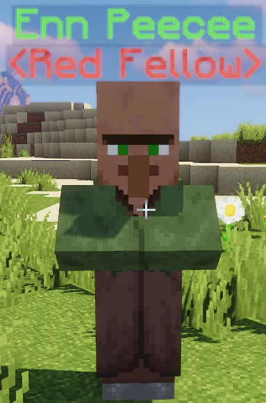
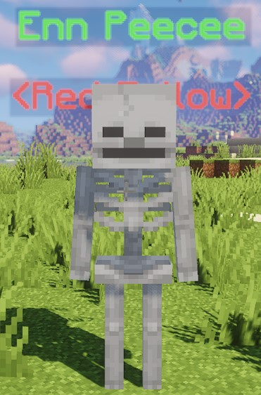

[](https://magmaguy.com/webapp/webapp.html)

# Definições de configuração

<div align="center">

### isEnabled

Define se um NPC está ativo.

| Chave       |       Valores        | Padrão |
|-----------|:-------------------:|:-------:|
| `isEnabled` | [Booleano](#booleano) | `true`  |

<details> 

<summary><b>Exemplo</b></summary>

<div align="left">

```yml
isEnabled: true
```

</div>

</details>

***

### name

Define o nome de exibição de um NPC. Suporta [Códigos de Cor](#códigos_de_cor).

| Chave       |       Valores        | Padrão |
|-----------|:-------------------:|:-------:|
| `name` | [String](#string) |  nenhum   |

<details> 

<summary><b>Exemplo</b></summary>

<div align="left">

```yml
name: "&aEnn Peecee"
```

<div align="center">


</div>

</div>

</details>

***

### scale

Define a escala (tamanho) do NPC.

| Chave       |       Valores        | Padrão |
|-----------|:-------------------:|:-------:|
| `scale` | [Multiplicador](#multiplicador) | `1.0` |

Ao escalar, `1.0` representa o tamanho padrão. Para tornar a entidade maior, aumente o valor (por exemplo, `1.2`). Para tornar a entidade menor, diminua o valor (por exemplo, `0.8`).

<details> 

<summary><b>Exemplo</b></summary>

<div align="left">

```yml
scale: 1.2
```

</div>

</details>

***

### role

Define a função do NPC, sob o nome. Apenas visual. Suporta [Códigos de Cor](#códigos_de_cor).

| Chave       |       Valores        | Padrão |
|-----------|:-------------------:|:-------:|
| `role` | [String](#string) |  nenhum   |

<details> 

<summary><b>Exemplo</b></summary>

<div align="left">

```yml
role: "&c<Camarada Vermelho>"
```

<div align="center">


</div>

</div>

</details>

***

### profession

Define a profissão do NPC, que define a sua skin quando **não** está a usar um disfarce.

| Chave       |       Valores        | Padrão |
|-----------|:-------------------:|:-------:|
| `profession` | [Profissão](https://hub.spigotmc.org/javadocs/spigot/org/bukkit/entity/Villager.Profession.html) |  `NITWIT`   |

<details> 

<summary><b>Exemplo</b></summary>

<div align="left">

```yml
profession: NITWIT
```

<div align="center">



</div>

</div>

</details>

***

### greetings

Define a lista de saudações que o NPC diz quando um jogador se aproxima.

| Chave       |       Valores        | Padrão |
|-----------|:-------------------:|:-------:|
| `greetings` | [Lista de Strings](#lista_de_strings) |  nenhum   |

<details> 

<summary><b>Exemplo</b></summary>

<div align="left">

```yml
greetings:
- Olá!
- Bom dia.
```

<div align="center">


</div>

</div>

</details>

***

### dialog

Define o diálogo que o NPC irá dizer enquanto um jogador está por perto (No caso do `interactionType` `DIALOG`, este seria o diálogo).

| Chave       |       Valores        | Padrão |
|-----------|:-------------------:|:-------:|
| `dialog` | [Lista de Strings](#lista_de_strings) |  nenhum   |

<details> 

<summary><b>Exemplo</b></summary>

<div align="left">

```yml
dialog:
- Eu gosto de maçãs!
- Está um calor.
```

<div align="center">


</div>

</div>

</details>

***

### farewell

Define a mensagem de despedida do NPC.

| Chave       |       Valores        | Padrão |
|-----------|:-------------------:|:-------:|
| `farewell` | [Lista de Strings](#lista_de_strings) |  nenhum   |

<details> 

<summary><b>Exemplo</b></summary>

<div align="left">

```yml
farewell:
- Até à próxima!
- Adeus!
```

<div align="center">


</div>

</div>

</details>

***

### canTalk

Define se o NPC pode falar.

| Chave       |       Valores        | Padrão |
|-----------|:-------------------:|:-------:|
| `canTalk` | [Booleano](#booleano) | `true`  |

<details> 

<summary><b>Exemplo</b></summary>

<div align="left">

```yml
canTalk: true
```

</div>

</details>

***

### activationRadius

Define o raio em que um NPC pode detetar a aproximação de um jogador.

| Chave       |       Valores        | Padrão |
|-----------|:-------------------:|:-------:|
| `activationRadius` | [Double](#double) |  `3.0`  |

<details> 

<summary><b>Exemplo</b></summary>

<div align="left">

```yml
activationRadius: 3.0
```

</div>

</details>

***

### interactionType

Define o tipo de interação que o NPC irá fazer.

| Chave       |      Valores       | Padrão |
|-----------|:-----------------:|:-------:|
| `interactionType` |    Especial [1]    |  nenhum   |

<details> 

<summary><b>Exemplo</b></summary>

<div align="left">

```yml
interactionType: TELEPORT_BACK
```

</div>

</details>

***

### noPreviousLocationMessage

Quando um NPC Teletransportador não tem nenhuma localização anterior para onde pode teletransportar um jogador, ele exibirá esta mensagem. Aceita [Códigos de Cor](#códigos_de_cor)

| Chave       |       Valores        | Padrão |
|-----------|:-------------------:|:-------:|
| `noPreviousLocationMessage` | [String](#string) |  nenhum   |

<details> 

<summary><b>Exemplo</b></summary>

<div align="left">

```yml
noPreviousLocationMessage: '&8[EliteMobs] &cNão foi possível enviar-te de volta para a tua localização anterior - nenhuma localização anterior encontrada!'
```

<div align="center">


</div>

</div>

</details>

***

### timeout

Define a quantidade de tempo, em minutos, antes que um NPC desapareça permanentemente.

| Chave       |       Valores        | Padrão |
|-----------|:-------------------:|:-------:|
| `timeout` | [Inteiro](#inteiro) |  `0` (nunca)   |

<details> 

<summary><b>Exemplo</b></summary>

<div align="left">

```yml
timeout: 0
```

</div>

</details>

***

### questFileName

Define as quests que o NPC dá.

| Chave       |       Valores        | Padrão |
|-----------|:-------------------:|:-------:|
| `questFileName` | [Lista de Strings](#lista_de_strings) |  nenhum   |

<details> 

<summary><b>Exemplo</b></summary>

<div align="left">

```yml
questFileName:
- minha_quest_um.yml
- minha_quest_dois.yml
```

</div>

</details>

***

### disguise

Define o disfarce LibsDisguises que o NPC tem.

| Chave       |       Valores        | Padrão |
|-----------|:-------------------:|:-------:|
| `disguise` | [Formato LibsDisguises]($language$/elitemobs/libsdisguises.md) |  nenhum   |

<details> 

<summary><b>Exemplo</b></summary>

<div align="left">

```yml
disguise: SKELETON
```

<div align="center">



</div>

</div>

</details>

***

### customDisguiseData

Define os dados para um disfarce personalizado LibsDisguises.

| Chave       |       Valores        | Padrão |
|-----------|:-------------------:|:-------:|
| `customDisguiseData` | [Formato LibsDisguises]($language$/elitemobs/libsdisguises.md&section=como-posso-disfarçar-uma-entidade-com-um-disfarce-personalizado?) |  nenhum   |

<details> 

<summary><b>Exemplo</b></summary>

<div align="left">

```yml
disguise: custom:meu_disfarce_legal
customDisguiseData: player meu_disfarce_legal setskin {"id":"364acb6d-9050-46f7-b5fb-f8c3fd83a6fc","name":"Unknown","properties":[{"name":"textures","value":"ewogICJ0aW1lc3RhbXAiIDogMTYxMTk4ODA4Nzc1NSwKICAicHJvZmlsZUlkIiA6ICJkZGVkNTZlMWVmOGI0MGZlOGFkMTYyOTIwZjdhZWNkYSIsCiAgInByb2ZpbGVOYW1lIiA6ICJEaXNjb3JkQXBwIiwKICAic2lnbmF0dXJlUmVxdWlyZWQiIDogdHJ1ZSwKICAidGV4dHVyZXMiIDogewogICAgIlNLSU4iIDogewogICAgICAidXJsIiA6ICJodHRwOi8vdGV4dHVyZXMubWluZWNyYWZ0Lm5ldC90ZXh0dXJlLzliYmVkODQzNWY4YmYyNzhhZmUyNmU2NGZkOTI2YjhiMzc3MzJkODhlMzM0ODk3ZGJkNTI3ZDU2ZmY5MTk5MGUiCiAgICB9CiAgfQp9","signature":"ujLq1joYVktuQAp1xpFKlxQFUVinSePiDBiVCAxxix/mA5vP86i/eAOfb1mtGjaAZ6sO0l2olbzvycnGXNBtbAxgqprguROXY4tpWiePVTDmy3iD4GdOCxHAkYLoyMV5qTT4SNsldUFFuND8GSEgbNMltKDLmhNKwzm08iCigPfpeuYpwljgJPxu6ka54PKNaQu4doI0ZDZXKqq4hPhR3Bs2Sz9MI0SmdmQWwcCzUz3DFdVno27fmQ6LwqmT+eSoOv0EttVG/XMaTYQ5lhBY61mqf6WlJyYVUSfjJk1AbYsctu7dWM+sbY8jFq5ljvXJGGr5TyKi+fs8vHy06Z2go20QgTYOw+caFxFijAS6fgm3oY57VEO/+/9OLHdD+Z9BrWqQWcIIrVeIfxjue/yt4pyeVv9jX59hjNFjhcPEwotkxJ+vZ96WlTLWDG4BiqauDr2VeGyLlVaygO9ZU0wwsN65iSh91GI3tMIA5wbDR0Hts/9ABvt9eafHbowS+4SZXN0i9mYnKg7op1eiB8nMEAGsPJg3DwsmUrh3ACAapQ6eYHiJpo59RXDqKlRcXwo7wsEFp//5LgQWbPj0NP3nxnywdpozqSAeq6236qlhE9BT9eiyJ41V9sMelYFEWMlUAltR40NdbIrHB0J3nmfuLJz44/sTwWf6P1khOy//XX0="}],"legacy":false}
```

<div align="center">


</div>

</div>

</details>

***

### customModel

Define o modelo personalizado ModelEngine que o NPC irá usar.

| Chave       |       Valores        | Padrão |
|-----------|:-------------------:|:-------:|
| `customModel` | [String](#string) |  nenhum   |

<details> 

<summary><b>Exemplo</b></summary>

<div align="left">

```yml
customModel: MEU_MODELO_UM
```

</div>

</details>

***

### arena

Define o nome do ficheiro da arena para a qual o NPC irá abrir um menu (requer o `interactionType` `ARENA_MASTER`).

| Chave       |        Valores         | Padrão |
|-----------|:---------------------:|:-------:|
| `arena` | [Nome do Ficheiro](#nome_do_ficheiro) |  nenhum   |

<details> 

<summary><b>Exemplo</b></summary>

<div align="left">

```yml
arena: minha_arena.yml
```

</div>

</details>

***

### command

Define o comando que o NPC irá executar (requer o `interactionType` `COMMAND`).

| Chave       |        Valores         | Padrão |
|-----------|:---------------------:|:-------:|
| `command` | [String](#string) |  nenhum   |

<details> 

<summary><b>Exemplo</b></summary>

<div align="left">

```yml
command: diga Olhem para mim a executar um comando, que fixe!
```

<div align="center">


</div>

</div>

</details>

***

### spawnLocation

Define a localização de spawn dos NPCs. Deve definir isto através do comando `/em spawnnpc <nome_do_ficheiro_npc.yml>`.

| Chave       |        Valores         | Padrão |
|-----------|:---------------------:|:-------:|
| `spawnLocation` | [String](#string) |  nenhum   |

<details> 

<summary><b>Exemplo</b></summary>

<div align="left">

```yml
spawnLocation: meu_mundo,10,50,10,0,0
```

</div>

</details>

***

### spawnLocations

Define as localizações de spawn dos NPCs. Deve definir isto através do comando `/em spawnnpc <nome_do_ficheiro_npc.yml>`.

| Chave              |           Valores            | Padrão |
|------------------|:---------------------------:|:-------:|
| `spawnLocations` | [Lista de Strings](#lista_de_strings) |  nenhum   |

<details> 

<summary><b>Exemplo</b></summary>

<div align="left">

```yml
spawnLocations:
- meu_mundo,10,50,10,0,0
- meu_mundo,-10,50,-10,0,0
```

</div>

</details>

### instanced

Define se o NPC deve ser instanciado (para uso em masmorras instanciadas).

| Chave              |           Valores            | Padrão |
|------------------|:---------------------------:|:-------:|
| `instanced` | [Booleano](#booleano) |  `false`   |

<details> 

<summary><b>Exemplo</b></summary>

<div align="left">

```yml
instanced: false
```

</div>

</details>

</div>

***

<details> 

<summary align="center"><b>Exemplo de Configuração de NPC</b></summary>

<div align="left">

```yml
isEnabled: true
name: "&cRubin Vermelho"
role: "&a<NPC Genérico>"
profession: NITWIT
greetings:
- Olá!
- Olá!
dialog:
- Ótima conversa!
- Prazer em falar contigo!
farewell:
- Adeus!
- Até à próxima!
canTalk: true
activationRadius: 4
interactionType: CHAT
timeout: 0
questFileName:
- minha_quest.yml # o interactionType do npc deve ser definido para CUSTOM_QUEST_GIVER
disguise: SKELETON
customDisguiseData: #usado quando um libsdisguise personalizado está a ser definido
customModel: MODELO_UM
arena: minha_arena.yml #o interactionType do npc deve ser definido para ARENA_MASTER
command: /say Olá Mundo! #o interactionType do npc deve ser definido para COMMAND
spawnLocation: meu_mundo,584,55,127,90,10 #lembre-se de que os NPCs usam inclinação e rotação para definir para onde estão a olhar. isso também é definido automaticamente ao executar o comando /em spawnnpc <nome_do_ficheiro_npc.yml>, portanto, certifique-se de que se posiciona onde pretende que o NPC esteja virado ao executar o comando.
```

<div align="center">


</div>

</div>

</details>

***

## Especial [1]
A seguir está a lista de tipos de interação de NPC válidos:

| Tipo                          |                                Descrição                                |
|-------------------------------|:-------------------------------------------------------------------------:|
| `GUILD_GREETER`               |                     Abre o menu do guild de aventureiros                     |
| `CHAT`                        |               O clique direito percorre o `dialog`                 |
| `CUSTOM_SHOP`                 |                        Abre o menu de loja personalizado                       |
| `PROCEDURALLY_GENERATED_SHOP` |                   Abre a loja gerada processualmente                    |
| `BAR`                         |                            Abre o menu de bar                             |
| `ARENA`                       |                           Abre o menu de arena                           |
| `QUEST_GIVER`                 |               Abre o menu de missões geradas processualmente                |
| `CUSTOM_QUEST_GIVER`          |      Abre o menu de missões para um conjunto de missões específico definido em `questFileName`      |
| `NONE`                        |                              Sem interações                             |
| `SELL`                        |                            Abre o menu de venda                            |
| `TELEPORT_BACK`               | Teletransporta os jogadores de volta para a última localização do mundo não-elitemobs em que estavam |
| `SCRAPPER`                    |                           Abre o menu de sucata                           |
| `REPAIRMAN`                   |                           Abre o menu de reparo                           |
| `ENCHANTER`                   |                          Abre o menu de encantamento                           |
| `REFINER`                     |                          Abre o menu de refinador                           |
| `UNBINDER`                    |                           Abre o menu de desvinculação                          |
| `ARENA_MASTER`                |          Abre o menu de arena para a arena definida em `arenaFilename`        |
| `COMMAND`                     |                     Executa o comando definido em `command`                     |

*Para mais informações sobre o que o SCRAPPER e tipos de interação semelhantes fazem, clique [aqui]($language$/elitemobs/item_upgrade_system.md).*
